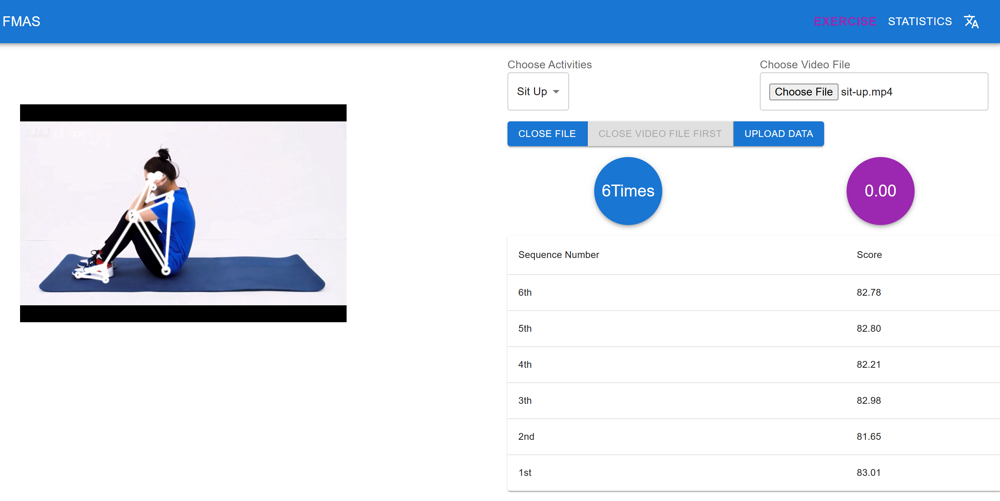
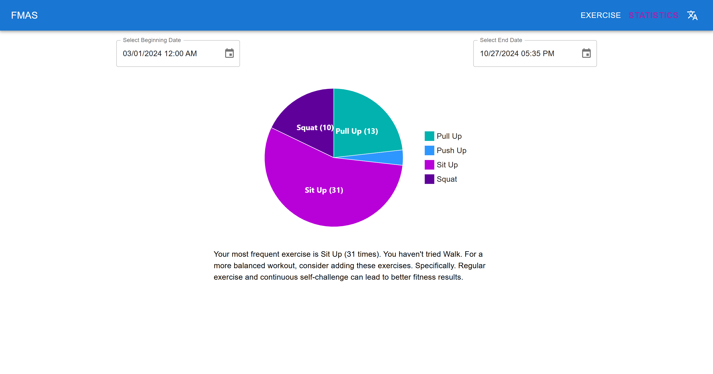

# Fitness Movement Analyzing System

The **Fitness Movement Analyzing System** is an innovative web application that utilizes **MediaPipe** and **TensorFlow.js** to recognize key human body landmarks and calculate specific joint angles to count and score five types of fitness exercises, such as push-ups and sit-ups. This system provides detailed exercise evaluation and feedback, allowing users to monitor and improve their fitness performance.

## Features

1. **Exercise Evaluation**: Analyze fitness movements from real-time camera input or uploaded video files.
2. **Responsive Design with Multi-Language Support**: Optimized for both mobile and desktop environments, with support for both English and Chinese, ensuring a smooth user experience across devices and languages.
3. **Personalized Data Management**: Each user has a dedicated account where personal workout data is securely stored, enabling individual fitness history tracking.
4. **Personalized Training Recommendations**: The system offers comprehensive visualizations of past performance with detailed analytics and tailored training recommendations based on workout data.

## System Architecture

The system is built with **React.js** for the front end and **Express.js** for the back end. It leverages MediaPipe for motion tracking and TensorFlow.js for real-time analysis.

### Screenshots

- **Movement Evaluation Page**
  


- **History Data & Personalized Suggestions Interface**



## Dependencies

- `node.js`
- `sqlite3`

## Installation and Deployment

1. Install the necessary packages:
   ```bash
   npm install
   ```
2. Build the application:
   ```bash
   npm run build
   ```
3. Initialize the database:
   ```bash
   node database.js
   ```
4. Start the server:
   ```bash
   node app.js
   ```